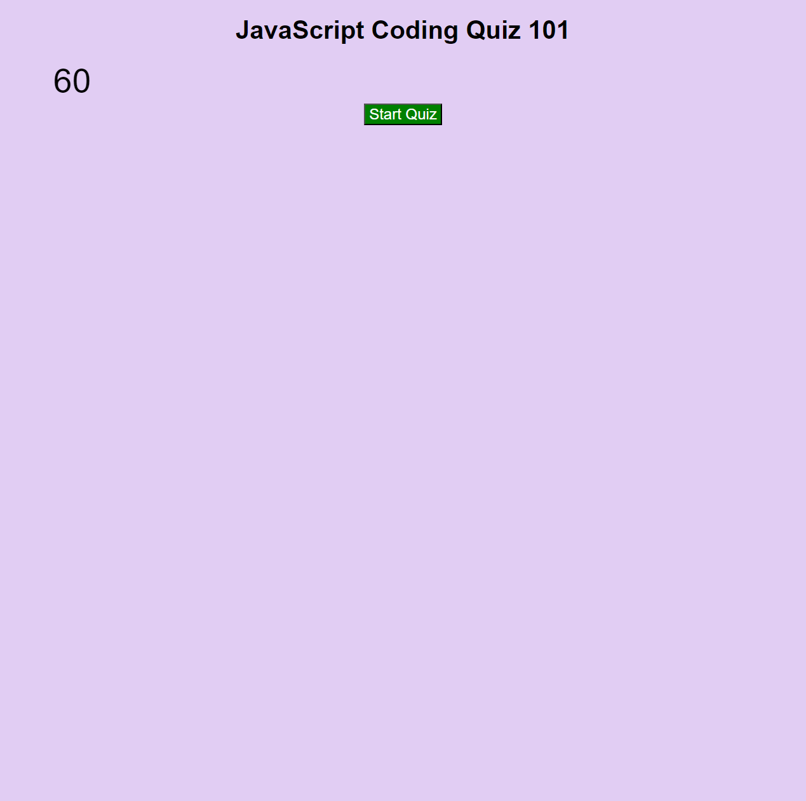

# Coding Quiz

https://dizzymouse0.github.io/coding-quiz/

## Project description: 
A timed JavaScript quiz that locally stores scores and name

### Why?
    This quiz was made to provide practice to the burgeoning JavaScript coder to help improve their knowledge and track their progress.

## Credits
Code built looking at examples and testing on my own.
W3 Schools tutorials,
W3 Quizes,
MDN tutorials,
and classroom examples.
